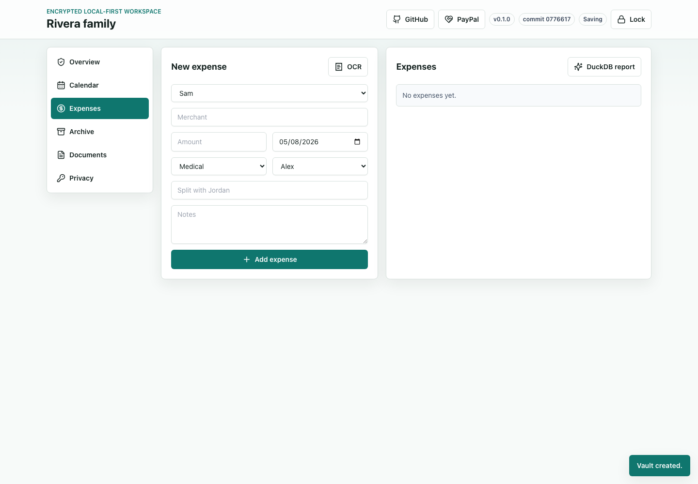
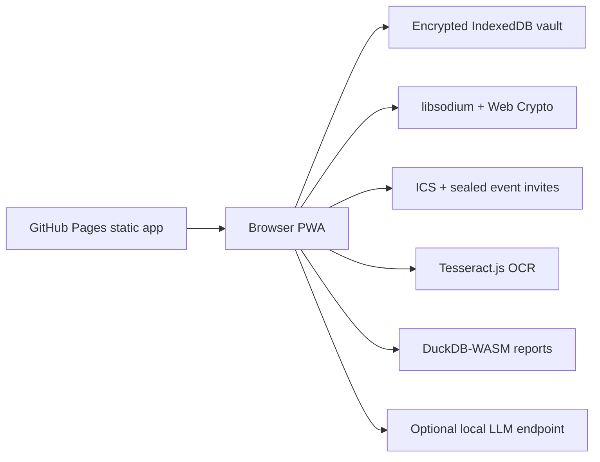

# co-parent-vault


Private local-first co-parenting tools for calendars, expenses, documents, and communication archives.

Live app:

https://baditaflorin.github.io/co-parent-vault/

Repository:

https://github.com/baditaflorin/co-parent-vault

Support:

https://www.paypal.com/paypalme/florinbadita



## Quickstart

```bash
npm install
make dev
make test
make build
make pages-preview
```

## What It Does

`co-parent-vault` replaces the sensitive parts of court-recommended co-parenting SaaS with a static local-first PWA: encrypted household vaults, shared calendar events, ICS import/export, sealed event invites, expense tracking, receipt OCR, communication archives, child document storage, DuckDB-WASM reports, and optional localhost LLM summaries.

## Architecture



## Docs

docs/architecture.md

docs/adr/

docs/deploy.md

docs/privacy.md
