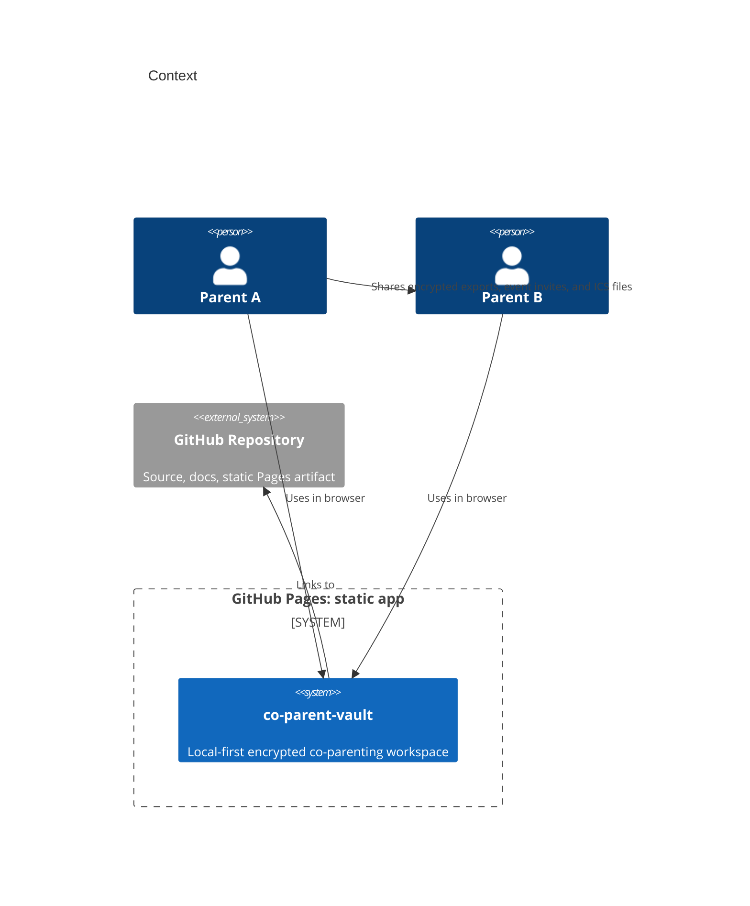
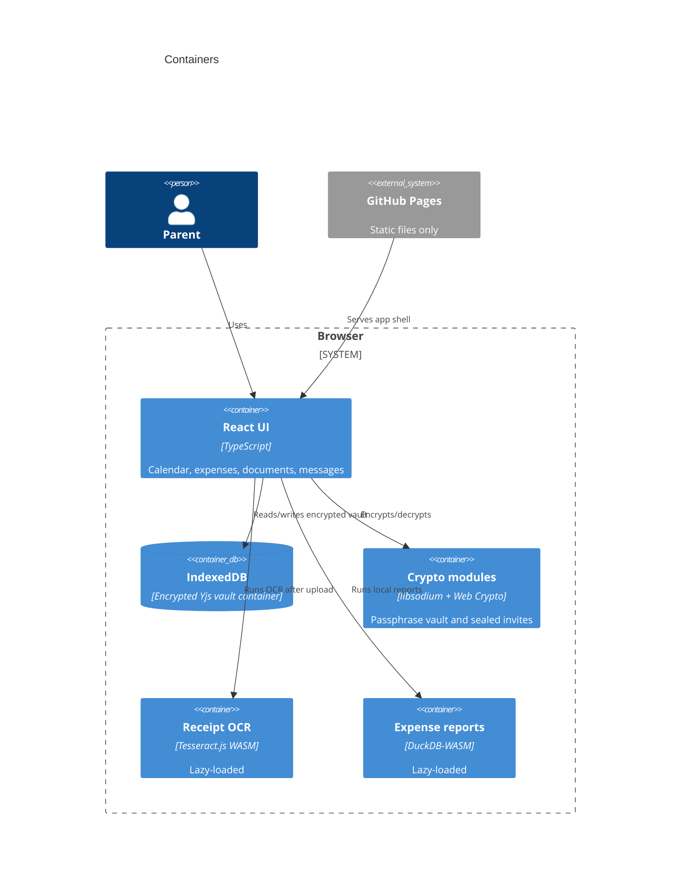

# Architecture

`co-parent-vault` is a pure GitHub Pages PWA. The browser is the only runtime.

```mermaid
C4Context
title Context
Person(parentA, "Parent A")
Person(parentB, "Parent B")
System_Boundary(pages, "GitHub Pages: static app") {
  System(app, "co-parent-vault", "Local-first encrypted co-parenting workspace")
}
System_Ext(repo, "GitHub Repository", "Source, docs, static Pages artifact")
Rel(parentA, app, "Uses in browser")
Rel(parentB, app, "Uses in browser")
Rel(parentA, parentB, "Shares encrypted exports, event invites, and ICS files")
Rel(app, repo, "Links to")
```

```mermaid
C4Container
title Containers
Person(parent, "Parent")
System_Boundary(browser, "Browser") {
  Container(ui, "React UI", "TypeScript", "Calendar, expenses, documents, messages")
  ContainerDb(indexeddb, "IndexedDB", "Encrypted Yjs vault container")
  Container(crypto, "Crypto modules", "libsodium + Web Crypto", "Passphrase vault and sealed invites")
  Container(ocr, "Receipt OCR", "Tesseract.js WASM", "Lazy-loaded")
  Container(sql, "Expense reports", "DuckDB-WASM", "Lazy-loaded")
}
System_Ext(pages, "GitHub Pages", "Static files only")
Rel(parent, ui, "Uses")
Rel(ui, indexeddb, "Reads/writes encrypted vault")
Rel(ui, crypto, "Encrypts/decrypts")
Rel(ui, ocr, "Runs OCR after upload")
Rel(ui, sql, "Runs local reports")
Rel(pages, ui, "Serves app shell")
```
